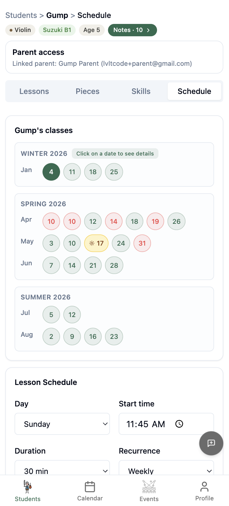
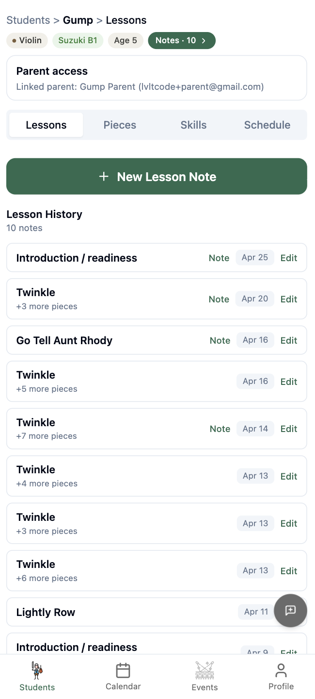
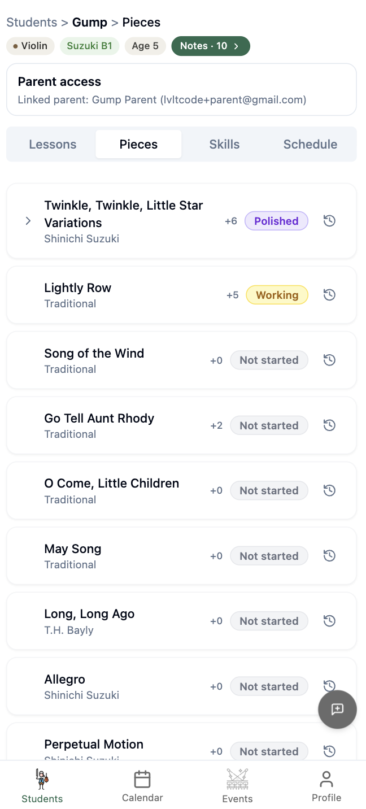
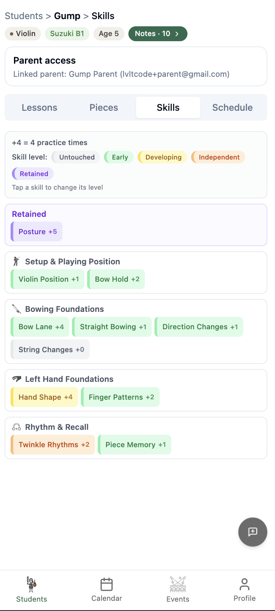
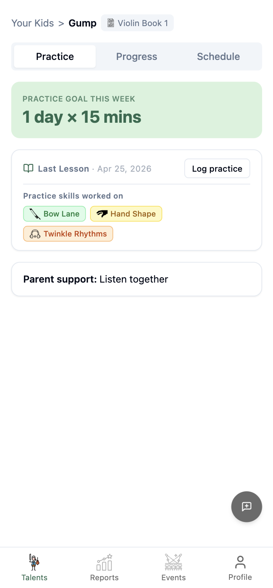
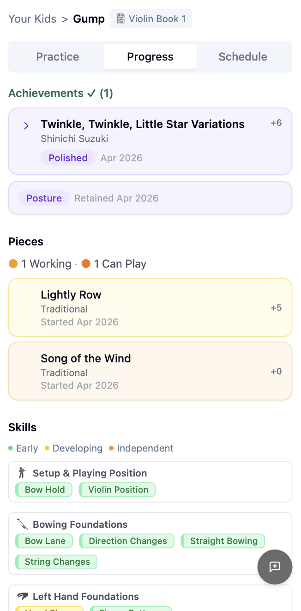
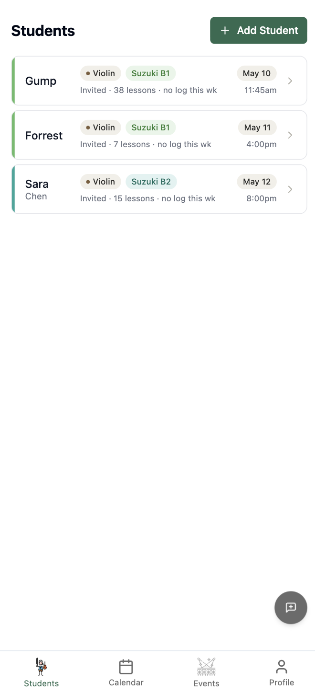

# Cadence: Building a Music Education Platform

> **Live prototype:** [cadence-prototype-psi.vercel.app](https://cadence-prototype-psi.vercel.app) · **Production app:** [cadence-osa.com](https://cadence-osa.com)

## What this is

Cadence is a lesson continuity and practice management platform for Suzuki music teachers and parents. It closes the gap between weekly lessons and daily home practice — replacing the mix of Google Calendar, text messages, and handwritten notes that most private studios run on.

Teachers record what happened in a lesson. Parents see what to practice. Progress tracks itself.

## Product screens


*Seasonal calendar with auto-generated lesson dates, cancellation tracking, and recurrence settings.*


*Lesson history with piece assignments. Each note links to specific Suzuki repertoire and skills worked on.*


*Suzuki Book 1 repertoire with practice counts and status progression: Not started → Working → Polished.*


*Technique skills organized by Suzuki pedagogy categories. Tap to assess. Practice counts accumulate across lessons.*


*Parent view: practice goal for the week, skills to focus on, and a concrete parent support tip.*


*Progress visibility: achievements, piece status, and skill levels — read-only, updated by teacher.*


*Teacher studio overview. Each card shows instrument, Suzuki level, lesson count, and next lesson date.*

## Why existing tools fail

- **Google Calendar** handles scheduling but knows nothing about lesson content or what to practice.
- **Practice apps** assume students are self-directed. Suzuki students are 4–8 years old. Parents guide practice.
- **LMS platforms** are built for classrooms. Private music instruction is 1-on-1 with a parent-child dynamic.
- **Notes apps + messaging** fragment the record. Teachers repeat instructions. Parents lose track between weeks.
- **Nothing connects the lesson to the practice session.** That's the core gap.

## Core workflow

- **Teacher records lesson** — pieces covered, skills assessed, practice goal set, parent-visible notes written.
- **Parent sees practice guidance** — what to focus on, how many days, how many minutes. No musical knowledge required.
- **Parent logs practice** — confirms sessions completed. Teacher sees compliance before next lesson.
- **Teacher reviews and continues** — full history of pieces, skills, and practice across weeks. No "what did we do last time?"

Loop repeats weekly. Each lesson builds on the last.

## System design

**Stack:** React + TypeScript, Supabase (PostgreSQL + RLS + Auth), Vercel, GitHub.


**RLS enforces access at the database level.** Teachers see only their students. Parents see only their linked children. A frontend bug cannot bypass access control — Postgres rejects the query before it returns data. Three parent-safe views filter lesson notes to exclude teacher observations and private fields.

**24 tables, 3 roles.** Teachers, parents, and super admins each have dedicated RLS policies. Admin has full CRUD via `super_admin_full_access` policies on every table — still enforced through Postgres, not application code.

**Data model (core):**

```
profiles (teacher / parent / super_admin)
    ↓
teachers → students → lessons → lesson_notes → piece_assignments
              ↓                                      ↓
        student_parents                         piece_progress → pieces → books
              ↓
           parents → practice_logs

skills → skill_groups → student_skill_states → student_skill_history (audit)

events → event_students (RSVP)
invites (token-based parent linking)
```

## Key decisions

- **RLS over app-level auth.** Access control in the database means a broken React component can't leak another teacher's students. Trade-off: RLS policies are harder to debug, but the security guarantee is worth it.
- **Lesson note as source of truth.** Piece assignments, skill assessments, and practice goals all hang off the lesson note. One record per session. No orphan data.
- **Parent-safe views.** Parents see practice guidance and progress but never teacher observations or private notes. Enforced via Postgres views, not frontend filtering.
- **Scope cuts that mattered.** Deferred: automated practice reminders, teacher analytics dashboard, multi-instrument support beyond violin Book 1. MVP stays focused on the lesson-practice loop.
- **Token-based parent invites.** Teachers send an email invite. Edge Function (Resend API) delivers a branded link. Parent accepts, RPC creates the student-parent link, RLS grants access. No manual admin step.

## Build approach

- **Planning first.** Five documents before any code: product brief, implementation plan, component spec, data model, scope boundaries. 80% of effort was planning; 20% was execution.
- **AI-assisted, not AI-autonomous.** Lovable for initial UI scaffolding. Claude Code for multi-file refactoring, RLS policies, and schema migrations. Manual coding for targeted fixes and edge cases.
- **QA via Playwright.** End-to-end tests for critical flows: login, lesson creation, practice assignment, parent view access.
- **What AI is bad at here:** design taste and scope discipline. Every screen needed manual direction on spacing, hierarchy, and empty states. AI will build features you didn't ask for if prompts are slightly ambiguous.

## What actually works

- **Parents know what to practice.** Practice goal, skill chips, and parent support tips — all set by the teacher, visible immediately after the lesson. No follow-up messages needed.
- **Teachers stop repeating themselves.** Full lesson history, piece status, and skill progression are visible before the next lesson. No "what did we do last time?"
- **Scheduling runs itself.** Recurrence rules generate the calendar. Teachers mark cancellations and makeups. No weekly back-and-forth.
- **RLS-first design prevented bugs.** Designing access policies before UI forced clarity on the data model. Several features that seemed simple had complex access implications — caught at the schema level, not in production.

## What I'd improve next

- **Books 2–10 skill definitions.** Schema supports it. Skill groups and piece data need seeding for the full Suzuki curriculum.
- **Practice analytics for teachers.** Aggregate practice compliance, lesson frequency, and skill progression across the studio.
- **Automated practice reminders.** Push notifications or email nudges on days parents haven't logged practice.
- **Multi-instrument support.** Data model is instrument-agnostic. UI assumes violin Book 1. Needs curriculum data and testing for cello, viola.

## Current status

In production at [cadence-osa.com](https://cadence-osa.com). Interactive prototype at [cadence-prototype-psi.vercel.app](https://cadence-prototype-psi.vercel.app). Core lesson-practice-scheduling loop is functional. Next phase: user validation with Suzuki teachers in Ontario.

---

*Built with: React, TypeScript, Supabase (PostgreSQL + RLS), Vercel, GitHub, Claude Code, Codex, Lovable, Playwright*

*Luke Dang — [GitHub](https://github.com/lvltcode) · [LinkedIn](https://www.linkedin.com/in/dangtranlevu/)*
