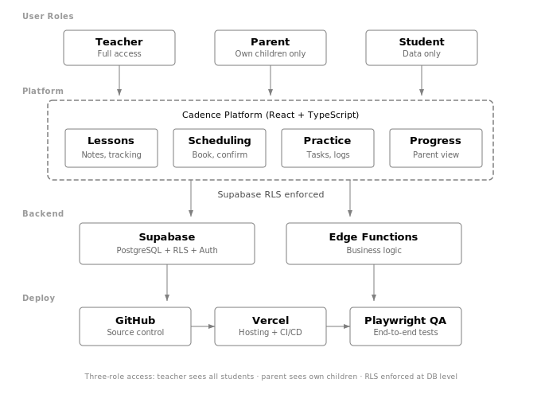

# Cadence: Building a Music Education Platform as a Solo AI-Native Builder



## The problem

Suzuki music education has a coordination problem. Teachers run lessons weekly, but the real learning happens at home — guided by parents who often have no musical background. Between sessions, parents forget practice instructions, teachers lose visibility into what happened at home, and scheduling becomes a manual back-and-forth that eats into teaching time.

Existing tools don't fit. Google Calendar handles scheduling but not lesson context. Practice apps assume the student is self-directed. LMS platforms are built for classrooms, not one-on-one music instruction with a parent-child dynamic.

Cadence is a platform designed specifically for this workflow: connecting teachers, parents, and students around lesson continuity, structured practice, and scheduling — without adding operational overhead to teachers who are already stretched thin.

## Users and workflow

Three roles interact with the system differently:

**Teachers** need to record lesson notes, assign practice tasks, track student progress across weeks, and manage scheduling without email chains. Their time is the bottleneck — every minute spent on admin is a minute not spent teaching.

**Parents** need clear practice guidance between lessons, visibility into what was covered, and a simple way to confirm or reschedule sessions. Most are not musicians. The interface has to be obvious without onboarding.

**Students** (primarily children in Suzuki programs) don't interact with the platform directly. Their progress is tracked through teacher observations and parent-reported practice logs.

The core workflow loop: Teacher records lesson → assigns practice → parent sees guidance → parent logs practice → teacher reviews before next lesson → cycle repeats.

## Architecture decisions

**Stack:** React + TypeScript frontend, Supabase backend (PostgreSQL + Row-Level Security + Auth), deployed on Vercel via GitHub.

**Why Supabase RLS matters here:** The multi-role access pattern is the hardest part of this system. A teacher should see all their students. A parent should see only their children. A student record is visible to both the assigned teacher and the linked parent — but not to other parents or other teachers' students. Supabase RLS policies enforce this at the database level rather than in application code, which means access control can't be accidentally bypassed by a frontend bug.

**Data model core:**

```
teachers → lessons → practice_tasks
    ↓                      ↓
students ← enrollments → parents
    ↓
practice_logs (parent-submitted)
progress_entries (teacher-recorded)
```

**Key tradeoff — scope discipline:** The original scope included a native behavioral assessment form (CBARQ-style), automated practice reminders, and a teacher analytics dashboard. All deferred. The MVP focuses on the core loop: lesson notes, practice guidance, scheduling. Everything else is post-validation.

## How AI changed the build process

This project was built entirely through AI-assisted development — no manual code writing. The workflow:

**Planning (Claude):** Product requirements, data model design, RLS policy logic, user flow mapping, and implementation sequencing were all produced through structured conversation. Five planning documents were generated before any code was written: product brief, implementation plan, component spec, data model, and scope boundaries.

**Frontend scaffolding (Lovable):** Initial UI components, page layouts, and navigation structure were generated through Lovable's prompt-based builder. This produced working React components in minutes rather than hours — but required significant iteration on UX details that Lovable doesn't handle well (empty states, error handling, loading patterns).

**Precision work (Claude Code + Codex):** Multi-file refactoring, RLS policy implementation, edge function logic, and bug fixes that required understanding the full codebase context. Claude Code handled architectural changes; Codex handled isolated logic tasks.

**QA (Playwright):** End-to-end testing for critical user flows — login, lesson creation, practice assignment, parent view access.

**What AI is bad at in this context:** Design taste. Lovable generates functional UI but defaults to generic patterns. Every screen required manual design direction — spacing, hierarchy, empty states, mobile breakpoints. AI also struggles with scope discipline; it will happily build features you didn't ask for if the prompt is slightly ambiguous.

## What I learned

**RLS-first architecture pays off early.** Designing access policies before building UI forced clarity on the data model. Several "simple" features turned out to have complex access implications that would have been bugs if discovered later.

**80/20 planning ratio works.** Spending 80% of effort on planning documents and 20% on execution (through AI tools) consistently produced better results than jumping into code. The planning documents became reusable context for every AI tool in the chain.

**Scope is the product decision.** The strongest product judgment in this project wasn't what to build — it was what to cut. Deferring the behavioral assessment form, the analytics dashboard, and automated reminders kept the MVP focused on the core coordination problem.

**Solo builder ≠ solo decision-maker.** Even without a team, the build process involved teacher interviews, parent feedback on practice flows, and iterative testing with real scheduling scenarios. The AI tools accelerated implementation, but product direction still required human judgment and user input.

## Current status

Cadence is in active development as my primary venture. The core lesson-practice-scheduling loop is functional. Next phase focuses on user validation with Suzuki teachers in Ontario before expanding scope.

---

*Built with: React, TypeScript, Supabase (PostgreSQL + RLS), Vercel, GitHub, Claude Code, Codex, Lovable, Playwright*

*Luke Dang — AI Product Builder · [GitHub](https://github.com/lvltcode) · [LinkedIn](https://www.linkedin.com/in/dangtranlevu/)*
